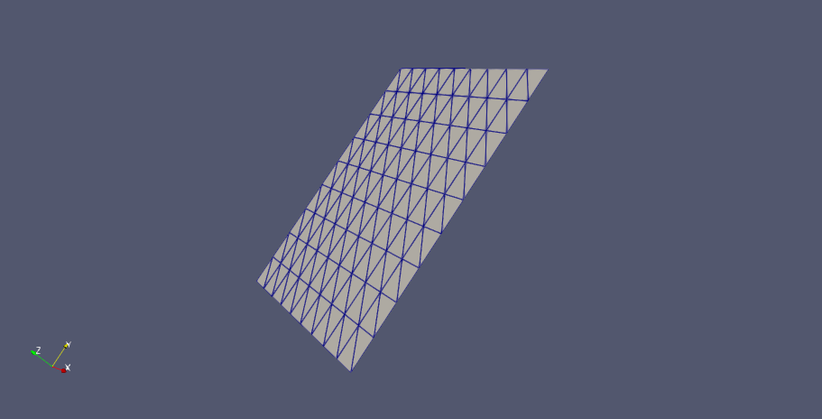

# abolladuras_radiales

Implementación de abolladuras sobre superficies 2D usando CGAL y funciones de base radial.

## Dependencias

- CGAL (>= 5.x)
- CMake (>= 3.10)
- Python 3 con matplotlib y numpy (para visualizacion)

## Compilacion

```bash
cmake -B build -DCMAKE_BUILD_TYPE=Release
cmake --build build
```

## Script: `scripts/generate_surface.py`

Genera un par de archivos (`.obj` + `_dents.txt`) con un timestamp como ID comun.

Dependencias: `numpy`.

### Uso

```bash
python3 scripts/generate_surface.py <filas> <columnas> <abolladuras> [opciones]
```

### Opciones generales

| Flag | Default | Descripcion |
|------|---------|-------------|
| `--x-range XMIN XMAX` | 0 200 | Rango en X |
| `--y-range YMIN YMAX` | 0 200 | Rango en Y |
| `--r-range RMIN RMAX` | 10 50 | Rango de radio |
| `--i-range IMIN IMAX` | 0 20 | Rango de profundidad maxima |
| `--out PREFIJO` | timestamp | Prefijo para los archivos de salida |

### Modos de altura (mutuamente excluyentes)

| Flag | Descripcion |
|------|-------------|
| `--flat` | `z = 0` (superficie plana) |
| `--random ZMIN ZMAX` | `z` aleatorio en `[ZMIN, ZMAX]` (default) |
| `--perlin SCALE OCTAVES` | Ruido Perlin 2D. `SCALE` controla el ancho de las ondas (mas grande = terreno mas suave), `OCTAVES` controla el detalle (mas octavas = mas variacion fina). Altura normalizada en `[-20, 20]`. |

Si no se especifica ningun modo, se usa `--random -5 5`.

### Ejemplos

```bash
# Grid 50x30 plano
python3 scripts/generate_surface.py 50 30 3 --flat

# Terreno con Perlin noise (scale grande → ondas suaves)
python3 scripts/generate_surface.py 100 80 5 --perlin 30 4

# Perlin con detalle fino (scale pequeno → mas variacion)
python3 scripts/generate_surface.py 100 80 5 --perlin 10 6

# Alturas aleatorias (default)
python3 scripts/generate_surface.py 50 30 3
```

## Binario: `bash_surface`

Aplica las abolladuras sobre un `.obj` usando funciones de base radial (RBF).

### Uso

```bash
./build/bash_surface entrada.obj dents.txt rbf_type salida.obj [before.obj]
```

`rbf_type`: `gaussian`, `multiquadric`, `inverse_multiquadric` o `wendland`.

Wendland φ₃,₁ tiene soporte compacto: vale 1 en el centro, 0 en el borde con transicion suave C², ideal para evitar cortes abruptos.

La intensidad `I` en `dents.txt` es la profundidad real en las mismas unidades que las alturas del mesh (profundidad maxima en el centro).

Si se pasa `before.obj`, guarda la triangulacion antes de aplicar las abolladuras.

### Ejemplos

```bash
./build/bash_surface entrada.obj dents.txt wendland salida.obj
./build/bash_surface entrada.obj dents.txt wendland salida.obj antes.obj
```

## Experimentos

Para cada funcion de base radial se ejecuto el mismo caso de prueba:
un grid de `100 x 80` puntos con terreno Perlin (scale=30, octaves=4)
en el rango `[0, 200]^2` y 5 abolladuras con radio en `[10, 50]` y
profundidad en `[5, 15]`.

```bash
python3 scripts/generate_surface.py 100 80 5 \
    --x-range 0 200 --y-range 0 200 \
    --perlin 30 4 --i-range 5 15 --r-range 10 50 \
    --out caso_base

./build/bash_surface caso_base.obj caso_base_dents.txt gaussian            out_g.obj
./build/bash_surface caso_base.obj caso_base_dents.txt multiquadric        out_m.obj
./build/bash_surface caso_base.obj caso_base_dents.txt inverse_multiquadric out_i.obj
./build/bash_surface caso_base.obj caso_base_dents.txt wendland            out_w.obj
```

## Visualizacion: `scripts/visualize.py`

Genera una imagen PNG con los puntos coloreados por altura y las abolladuras como circulos.

```bash
python3 scripts/visualize.py puntos.obj dents.txt
# Genera: vis_<timestamp>.png
```

## Resultados visuales

| RBF | Animacion |
|-----|-----------|
| Gaussiana |  |
| Multicuadrica |  |
| Multicuadrica inversa |  |

